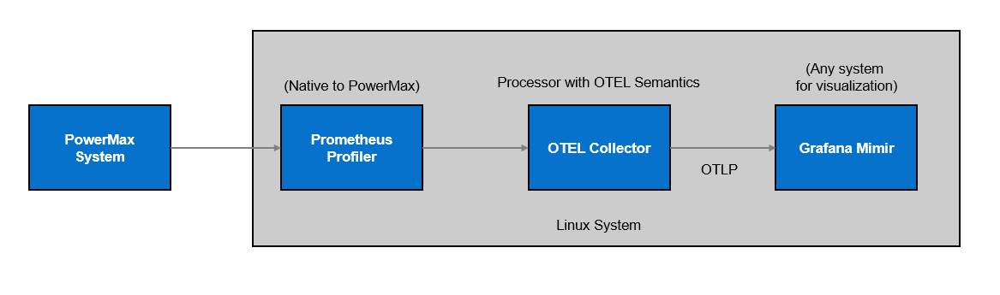

# Dell OpenTelemetry Transformer

Transform your collected PowerMax performance data into the OpenTelemetry data format using a pre-configured OpenTelemetry transform processor. The transform processor configuration can be deployed as part of an OpenTelemetry Prometheus collector-receiver to enable the OpenTelemetry pipeline.

The deployment pipeline works as follows:
* The PowerMax Prometheus profiler obtains metrics from the Unisphere API
* The OpenTelemetry Prometheus receiver is used to ingest the metrics from the PowerMax Prometheus profiler
* An OpenTelemetry Transform Processor is used to convert the metrics into the OpenTelemetry format

The overall pipeline will look similar to the following:




## OpenTelemetry Collector Installation

Copy the otel-config.yaml file from this repository to an appropriate location on your local system:
```
cp otel-config.yaml /etc/otel-contrib/otel-config.yaml
```
Edit the configuration file to supply:
* The IP address/port number for your Prometheus profiler
* The IP address/port number for your OpenTelemetry Receiver (the OTLP receiver, for example: Grafana Mimir)
* The authorization key/token for the receiver (as required)  

Then deploy, configure and run the OpenTelemetry (Contrib) Collector (which includes the Prometheus receiver) using either of the following methods:

1) Download and run the latest OpenTelemetry Collector Contrib Docker image, pointing the Docker image at the previously copied otel-config.yaml file:
```
docker pull otel/opentelemetry-collector-contrib:latest

docker run -v $(pwd)/config.yaml:/etc/otelcol-contrib/config.yaml -p 4317:4317 -p 4318:4318 -p 55679:55679 otel/opentelemetry-collector-contrib:latest
```
2) Clone or copy the latest version of the OpenTelemetry Collector Contrib project, build the project, and start the OpenTelemetry Collector passing in the path to the otel-config.yaml:

```
git clone https://github.com/open-telemetry/opentelemetry-collector-contrib.git
cd opentelemetry-collector-contrib
make install-tools
make otelcontribcol
./bin/otelcontribcol --config /etc/otel-contrib/otel-config.yaml
```
