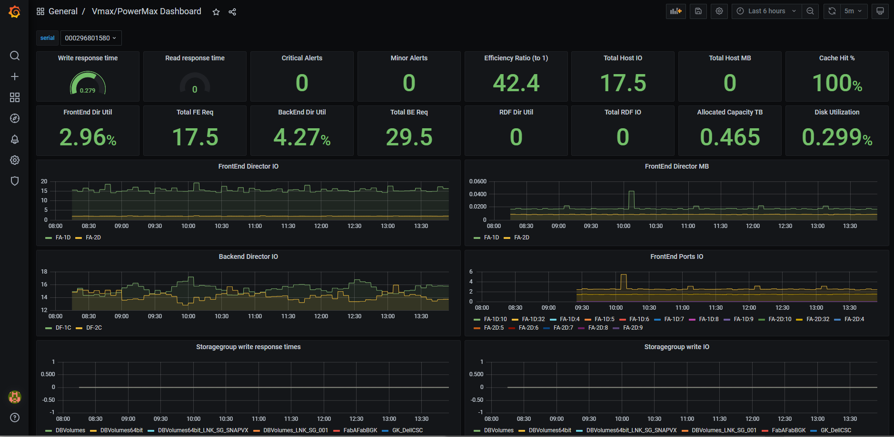

# PowerMax performance collector
Collect PowerMax performance data for use with Prometheus and Grafana. PmaxPerfPy uses the PyU4V library to collect performance data from Unisphere, see https://github.com/dell/PyU4V.



For customers interested in consuming **OpenTelemetry** data from the PowerMax performance collector, please see the OpenTelemetry section at the end of this README.

## Installation
* Clone or copy the repository package to a local directory, for example /opt

### Verify / edit requirements
The version of the PyU4V library has to match the Unisphere version of the PowerMax array. An older library version can still work but it is recommended to use the exact same version. By default, pmaxperfpy uses the latest available version. This can be changed in ```requirements.txt``` to the exact desired version, if needed.
```
$ cat requirements.txt
prometheus-client
pyu4v >= 10.1.0.2
```

### Build the container image
```
docker build -t pmaxperfpy:latest app
```

### Copy and edit the configuration file
* Please copy the provided pmax_config_example.json to pmax_config.json

The config file uses JSON syntax. It has a defaults sections and then one or more unisphere sections. Parameters, like username and password, for example, can be specified at the defaults section (valid for all Unispheres) or can be overriden on a per Unisphere section.
Both username and password can be specfified as values directly or as a dictionary with the key "fromEnvironment" to take the value from an environment variable at runtime.

Example configuration file with two Unisphere instances. The first one uses username and password from the defaults section. The second Unisphere uses the same username but the password is provided by an environment variable at runtime.
```json
"defaults": {
    "username": "smc",
    "password": "secret"
}
"unispheres": [
    {
        "hostname": "powermax1234.lab.local"
    },
    {
        "hostname": "5.6.7.8",
        "password": {
            "fromEnvironment": "PMAX5678_PASSWORD"
        }
    }
]
```
For Kubernetes please create a corresponding secret and configmap entry for the variables, i.e. ```kubectl create secret generic powermax5678 --from-literal=password=”smc”```


### Run at the command line or use the provided docker start script
```
./pmaxperf.py
start_pmaxperfpy.sh
```

#### Setup the target configuration for prometheus
* add the following section to your prometheus config, add collectors as targets
* for a new prometheus instance you can use the provided prometheus_config.yml example
```
- job_name: powermax
  honor_timestamps: true
  scrape_interval: 1m
  scrape_timeout: 50s
  metrics_path: /metrics
  scheme: http
  static_configs:
  - targets:
    - 192.168.1.1:8080
```

#### Import the provided dashboard into Grafana or create your own
* Before importing make sure Grafana has a datasource named Prometheus which is set as default datasource
* After the import datasource name and default setting can be changed again

### Setup Prometheus and Grafana
* can add into existing prometheus/grafana instances
* can use the provided scripts to start a grafana or prometheus instance

### Systemd startup scripts
* If no other container management is in place you can use the provided startup scripts
* For multiple collectors you need one startup script per collector instance
```
cp systemd_initscripts/docker-pmaxperfpy.service /etc/systemd/system/
cp systemd_initscripts/docker-grafana.service /etc/systemd/system/
cp systemd_initscripts/docker-prometheus.service /etc/systemd/system/
systemctl daemon-reload
systemctl enable docker-pmaxperfpy.service
systemctl enable docker-grafana.service
systemctl enable docker-prometheus.service
```

### OpenTelemetry Setup

Please see the OpenTelemetry README in the OpenTelemetry folder for information on the setup and configuration of the OpenTelemetry Collector for the PowerMax performance collector. 
